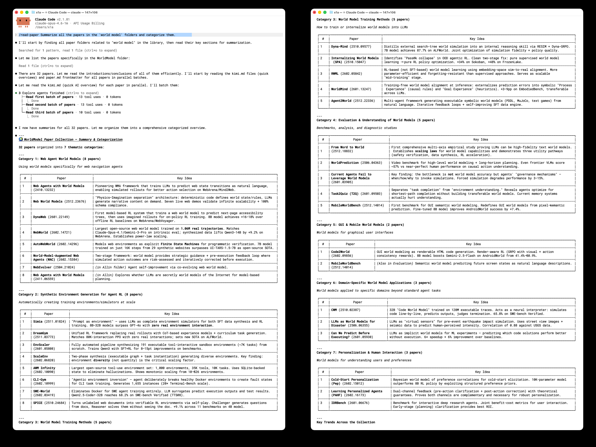

# ZoFiles

[](https://www.zotero.org)
[](https://github.com/windingwind/zotero-plugin-template)
[](LICENSE)

**Connect Claude (or other AI agents) to your Zotero library.**

ZoFiles turns your Zotero library into an agent-readable filesystem — mirroring your collection hierarchy as real directories, with per-paper folders containing Markdown, BibTeX, AI reviews, and more. Paired with a built-in [Claude Code skill](https://docs.anthropic.com/en/docs/claude-code/skills), it lets Claude read, summarize, cite, and compare your papers directly.

## Features

### File Management — Zotero to Filesystem

- **Collection mirroring** — Zotero's collection tree becomes a real directory tree
- **Per-paper folders** — Each paper gets its own folder named `{arxivId} - {title}`
- **Auto-sync** — Event-driven: add, modify, move, or delete a paper in Zotero, and the export updates automatically
- **Rich content per paper**:
  - `paper.pdf` — Symlink or copy of the PDF attachment
  - `paper.md` — Full-text Markdown via [arxiv2md.org](https://arxiv2md.org)
  - `kimi.md` — AI-generated review from [papers.cool](https://papers.cool) (Kimi)
  - `paper.bib` — BibTeX citation from arXiv
  - `arxiv.id` — Plain text arXiv identifier
  - `notes/*.md` — Zotero notes converted to Markdown
- **Link back to Zotero** — Optionally create linked attachments in Zotero pointing to exported files
- **Configurable** — Choose export root, folder naming, content toggles, and collection filters


> See a real exported paper folder: [`docs/example/`](docs/example/1706.03762%20-%20Attention%20Is%20All%20You%20Need/) — *Attention Is All You Need* with PDF, Markdown, BibTeX, Kimi review, and notes.

### Skills — AI-Powered Paper Reading

ZoFiles ships with a [Claude Code skill](https://docs.anthropic.com/en/docs/claude-code/skills) (`.claude/skills/read-paper/`) that teaches Claude how to work with your exported library:

- **Read papers selectively** — Frontmatter + table of contents first, then specific sections on demand
- **Cite accurately** — Always copies `paper.bib` verbatim; never hallucinates BibTeX
- **Summarize & compare** — Uses `paper.md` for deep reading, `kimi.md` for quick overviews
- **Browse your library** — Find papers by arXiv ID, explore collections by topic, read your notes
- **Works automatically** — The skill activates whenever you ask Claude to read, summarize, cite, or compare papers



> The skill works with any folder structure matching the ZoFiles format — you don't need to mention "ZoFiles" in your prompts.

## Exported File Structure

```
<export_root>/
├── Machine Learning/
│   ├── Transformers/
│   │   ├── 1706.03762 - Attention Is All You Need/
│   │   │   ├── paper.pdf        → symlink to Zotero storage
│   │   │   ├── paper.md         # full-text Markdown
│   │   │   ├── kimi.md          # AI review
│   │   │   ├── paper.bib        # BibTeX
│   │   │   ├── arxiv.id         # "1706.03762"
│   │   │   └── notes/
│   │   │       └── My Notes.md
│   │   └── 2311.10702 - Another Paper/
│   │       └── ...
│   └── Allin/                   # papers directly in "Machine Learning"
│       └── 2301.12345 - Some Paper/
│           └── ...
└── Computer Vision/
    └── ...
```

> When a collection has both sub-collections and direct papers, the direct papers are placed in an `Allin/` subdirectory to avoid mixing files and folders.

## ⚠️ Backup Your Data

ZoFiles is designed to be **read-only** with respect to your Zotero library — it only reads items and collections to build the export tree. However, **we strongly recommend backing up your Zotero data directory before first use**, just in case.

To back up: go to **Zotero → Settings → Advanced → Files and Folders** to find your data directory, then copy the entire folder to a safe location.

> **Disclaimer:** ZoFiles is provided as-is, without warranty of any kind. The authors are not responsible for any data loss or corruption that may occur. Use at your own risk.

## Installation

### From Release (Recommended)

1. Download the latest `.xpi` file from [Releases](../../releases)
2. In Zotero: Tools → Add-ons → gear icon → Install Add-on From File
3. Select the downloaded `.xpi` file
4. Restart Zotero

### From Source

```bash
git clone https://github.com/X1AOX1A/ZoFiles.git
cd ZoFiles
npm install
npm run build
```

The built `.xpi` will be in `.scaffold/build/`.

## Getting Started

After installing the plugin, a welcome dialog will appear on first launch guiding you through setup. You can also configure everything manually:

### Step 1: Open Settings

Go to **Zotero → Settings** (or press `⌘,` on macOS). You'll see **ZoFiles** in the left sidebar. Click it.

### Step 2: Set Export Root Directory

This is the most important setting — the folder where ZoFiles will create your paper tree.

- Click **Browse** to open a Finder/file picker and select a directory
- Or type/paste the full path directly into the text field (e.g. `/Users/you/Papers`)

### Step 3: Choose Collections

By default, all collections are exported. Uncheck any collections you want to exclude. The item count for each collection is shown in parentheses.

### Step 4: Configure Content

Choose which files to generate for each paper:

| Content | Description | Default |
|---|---|---|
| **PDF** | Symlink or copy of the PDF attachment | ✅ On |
| **Paper Markdown** | Full-text conversion via arxiv2md.org | ✅ On |
| **Kimi Review** | AI-generated summary from papers.cool | ✅ On |
| **BibTeX** | Citation data from arXiv | ✅ On |
| **Zotero Notes** | Your notes, converted to Markdown | ✅ On |
| **arXiv ID file** | Plain text file with the arXiv identifier | ✅ On |

> **Note:** Kimi Review requires a network request per paper. Some papers may not have a review available yet — the provider will fail gracefully for those.

### Step 5: Run Initial Export

Click **Rebuild** at the bottom of the settings panel. ZoFiles will scan all your selected collections, extract arXiv IDs, and create the folder tree with all enabled content.

A progress window will appear in the bottom-right corner showing the current item being processed. After completion, check your export root directory — you should see the full collection tree with per-paper folders.

> **Rebuild vs Force Full Rebuild:**
> - **Rebuild** (default) — Incremental. Only exports new or changed items and removes stale ones. Fast when most items are already exported.
> - **Force Full Rebuild** — Deletes the entire export directory and re-exports everything from scratch. Use this if the export gets into a broken state.
>
> Both modes benefit from the download cache (`~/.cache/ZoFiles/`). Network content (Markdown, Kimi, BibTeX) is cached on first download and reused on subsequent rebuilds, so even a Force Full Rebuild is faster the second time around.

### Step 6 (Optional): Fine-tune

- **Folder Format** — Change how paper folders are named (default: `{arxivId} - {title}`)
- **PDF Mode** — Switch between Symlink (saves disk space) and Copy (standalone)
- **Link Back** — Enable to create linked attachments in Zotero pointing to exported files
- **Auto Sync** — Enabled by default; ZoFiles will automatically update exports when you add, modify, move, or delete papers

### Step 7 (Optional): Set Up the Claude Code Skill

The read-paper skill works out of the box if you use Claude Code within a ZoFiles-exported directory. To set it up globally:

1. Open `.claude/skills/read-paper/SKILL.md`
2. Fill in your ZoFiles export root path in the `Paper Library Location` section
3. Start asking Claude to read, summarize, or cite your papers

## Configuration Reference

| Setting | Description | Default |
|---|---|---|
| Export Root | Directory where the paper tree is created | *(must be set)* |
| Folder Format | Paper folder naming template | `{arxivId} - {title}` |
| PDF Mode | Symlink (saves space) or Copy | Symlink |
| Export Content | Toggle each content type on/off | All on |
| Collections | Choose which collections to export | All |
| Auto Sync | Automatically export on changes | On |
| Link Back | Create linked attachments in Zotero | Off |
| Cache Path | Cache directory for downloaded content | `~/.cache/ZoFiles` |

### Folder Format Tokens

| Token | Example |
|---|---|
| `{arxivId}` | `2311.10702` |
| `{title}` | `Attention Is All You Need` |
| `{firstAuthor}` | `Vaswani` |
| `{year}` | `2017` |

Default: `{arxivId} - {title}`

## How It Works

1. **Event listener** — ZoFiles registers a `Zotero.Notifier` observer for item, collection, and collection-item events
2. **arXiv ID extraction** — For each paper, extracts the arXiv ID from multiple fields (archiveID → DOI → URL → extra)
3. **Collection tree mapping** — Builds the filesystem directory tree from Zotero's collection hierarchy
4. **Content providers** — Runs each enabled content provider (PDF, Markdown, BibTeX, etc.) to populate the paper folder
5. **Caching** — Downloaded content (Markdown, BibTeX, Kimi) is cached to avoid redundant API calls
6. **Index tracking** — Maintains `.zofiles-index.json` for efficient incremental updates and cleanup

### API Rate Limits

- **arxiv2md.org**: 30 requests/minute (built-in rate limiter)
- **papers.cool** (Kimi): No strict limit, but responses can be slow (~2-5s)
- **arxiv.org** (BibTeX): Standard rate limits apply

## Development

### Prerequisites

- [Node.js](https://nodejs.org/) (LTS)
- [Zotero 7](https://www.zotero.org/support/beta_builds) (beta)

### Setup

```bash
git clone https://github.com/X1AOX1A/ZoFiles.git
cd ZoFiles
npm install
cp .env.example .env
# Edit .env with your Zotero path
```

### Development Mode

```bash
npm start
```

This starts the dev server with hot reload — edit code and the plugin auto-reloads in Zotero.

### Build

```bash
npm run build
```

Outputs a production `.xpi` in `.scaffold/build/`.

### Project Structure

```
ZoFiles/
├── addon/                          # Static plugin resources
│   ├── manifest.json               # WebExtension manifest
│   ├── bootstrap.js                # Lifecycle entry
│   ├── prefs.js                    # Default preference values
│   ├── locale/                     # Localization (en-US, zh-CN)
│   └── content/
│       └── preferences.xhtml       # Settings panel UI
├── src/                            # TypeScript source
│   ├── index.ts                    # Entry point
│   ├── addon.ts                    # Plugin singleton
│   ├── hooks.ts                    # Lifecycle hooks
│   └── modules/
│       ├── notifier.ts             # Zotero event listener
│       ├── exporter.ts             # Export orchestrator + queue
│       ├── tree-builder.ts         # Collection → directory mapping
│       ├── arxiv-id.ts             # arXiv ID extraction
│       ├── html-to-md.ts           # HTML → Markdown converter
│       ├── preferences.ts          # Settings panel logic
│       ├── utils.ts                # Filesystem utilities
│       └── content-providers/      # Pluggable content generators
│           ├── provider.ts         # Base interface
│           ├── registry.ts         # Provider registry
│           ├── pdf-provider.ts
│           ├── markdown-provider.ts
│           ├── kimi-provider.ts
│           ├── bibtex-provider.ts
│           ├── notes-provider.ts
│           └── arxivid-provider.ts
├── .claude/
│   └── skills/
│       └── read-paper/             # Claude Code skill for paper reading
│           └── SKILL.md
├── package.json
├── tsconfig.json
└── zotero-plugin.config.ts
```

## Requirements

- **Zotero 7 or 8** (version 7.0+)
- **macOS or Linux** (symlink mode requires Unix-like OS; copy mode works everywhere)
- Papers must have extractable **arXiv IDs** — papers without arXiv IDs are skipped

## FAQ

**Q: What happens to papers without arXiv IDs?**
A: They are silently skipped. ZoFiles only exports papers with valid arXiv identifiers.

**Q: Can I use this on Windows?**
A: Yes, but set PDF mode to "Copy" instead of "Symlink". Symlinks on Windows require elevated permissions.

**Q: How do I trigger a full re-export?**
A: Go to Settings → ZoFiles. Click "Rebuild" for an incremental sync (fast), or "Force Full Rebuild" to start clean.

**Q: Does this modify my Zotero library?**
A: Only if you enable "Link back to Zotero", which creates linked file attachments. Otherwise, ZoFiles is read-only with respect to your library.

**Q: What if arxiv2md.org is down?**
A: The Markdown provider will fail gracefully for affected papers. Other content (PDF, BibTeX, notes) will still be exported. Cached content is unaffected.

**Q: Does the Claude Code skill work with other AI agents?**
A: The exported file structure is plain Markdown and BibTeX — any AI agent that can read files can work with it. The bundled skill is specifically designed for Claude Code, but the format is agent-agnostic.

## Credits

- Built with [zotero-plugin-template](https://github.com/windingwind/zotero-plugin-template) by windingwind
- Full-text Markdown via [arxiv2md.org](https://arxiv2md.org)
- AI reviews via [papers.cool](https://papers.cool) (Kimi)

## License

[MIT](LICENSE)
